## Silakan selesaikan Praktikum 1 sampai 5, lalu dokumentasikan berupa screenshot hasil pekerjaan Anda beserta penjelasannya!

### Praktikum 1

* Langkah 1

    ```dart
    //Langkah 1
    var list = [1, 2, 3];
    assert(list.length == 3);
    assert(list[1] == 2);
    print(list.length);
    print(list[1]);

    list[1] = 1;
    assert(list[1] == 1);
    print(list[1]);
    ```

<br></br>
* Langkah 2

    Silakan coba eksekusi (Run) kode pada langkah 1 tersebut. Apa yang terjadi? Jelaskan!

    **Jawab:** 

    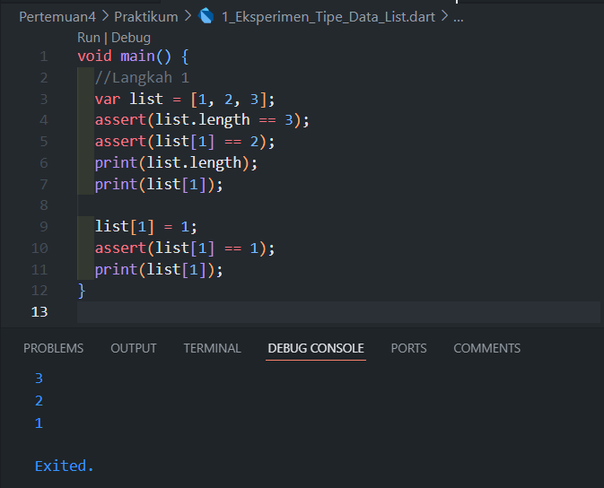

    Ketika kode tersebut dieksekusi, pertama-tama sebuah list berisi tiga elemen [1, 2, 3] dideklarasikan. Panjang list ini diverifikasi menggunakan assert, yang memeriksa apakah jumlah elemen dalam list (panjang list) adalah 3, dan hasilnya benar, sehingga eksekusi berlanjut tanpa masalah (jika tidak sesuai maka eksekusi program akan berhenti dan menghasilkan error). Kemudian, assert kedua digunakan untuk memastikan bahwa elemen pada indeks ke-1 bernilai 2, yang juga benar.

    Selanjutnya, panjang list dicetak, menghasilkan angka 3 sebagai output pertama. Setelah itu, elemen kedua dari list dicetak, menghasilkan angka 2. Pada tahap berikutnya, nilai elemen pada indeks ke-1 list diubah nilainya dari 2 menjadi 1, dan assert ketiga digunakan untuk memverifikasi perubahan tersebut. Karena elemen pada indeks ke-1 sekarang bernilai 1, tidak ada error, dan eksekusi berlanjut. Akhirnya, elemen kedua yang baru diubah tersebut dicetak, menghasilkan angka 1 sebagai output terakhir. Kode ini berjalan tanpa kendala karena semua kondisi assert terpenuhi, dan perubahan nilai pada list berhasil dilakukan.

<br></br>
* Langkah 3

    Ubah kode pada langkah 1 menjadi variabel final yang mempunyai index = 5 dengan default value = null. Isilah nama dan NIM Anda pada elemen index ke-1 dan ke-2. Lalu print dan capture hasilnya.

    Apa yang terjadi ? Jika terjadi error, silakan perbaiki.

    **Jawab:**

    Setelah di run, kode program tersebut akan menampilkan output seperti berikut:
    
    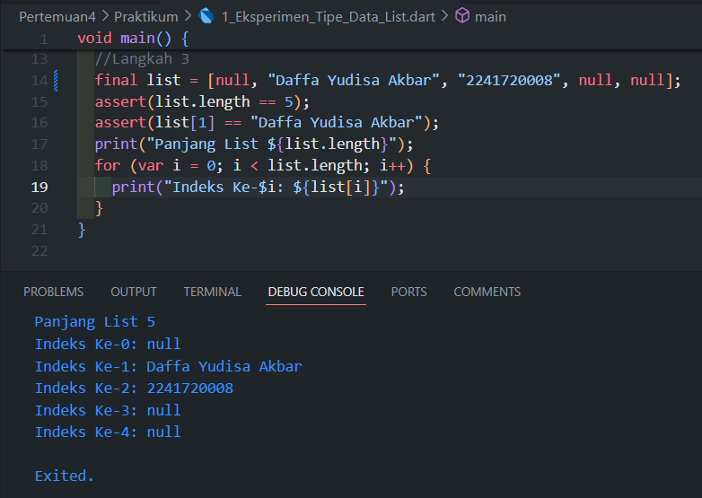

<br></br>

### Praktikum 2
* Langkah 1

    Ketik atau salin kode program berikut ke dalam fungsi main().
    ```dart
    void main() {
    var halogens = {'fluorine', 'chlorine', 'bromine', 'iodine', 'astatine'};
    print(halogens);
    }
    ```
<br></br>

* Langkah 2

    Silakan coba eksekusi (Run) kode pada langkah 1 tersebut. Apa yang terjadi? Jelaskan! Lalu perbaiki jika terjadi error.

    **Jawab:**

    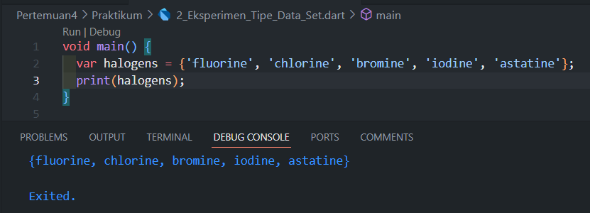

    Saat kode dijalankan, variabel halogens dideklarasikan sebagai set yang berisi lima elemen yakni ada 'fluorine', 'chlorine', 'bromine', 'iodine', dan 'astatine'. Perintah print(halogens) kemudian mencetak lima isi set di atas ke layar.

<br></br>

* Langkah 3
    
    Tambahkan kode program berikut, lalu coba eksekusi (Run) kode Anda. Apa yang terjadi ? 
    ```dart
    var names1 = <String>{};
    Set<String> names2 = {}; // This works, too.
    var names3 = {}; // Creates a map, not a set.

    print(names1);
    print(names2);
    print(names3);
    ```
    Jika terjadi error, silakan perbaiki namun tetap menggunakan ketiga variabel tersebut. Tambahkan elemen nama dan NIM Anda pada kedua variabel Set tersebut dengan dua fungsi berbeda yaitu .add() dan .addAll(). Untuk variabel Map dihapus, nanti kita coba di praktikum selanjutnya.

    **Jawab:**

    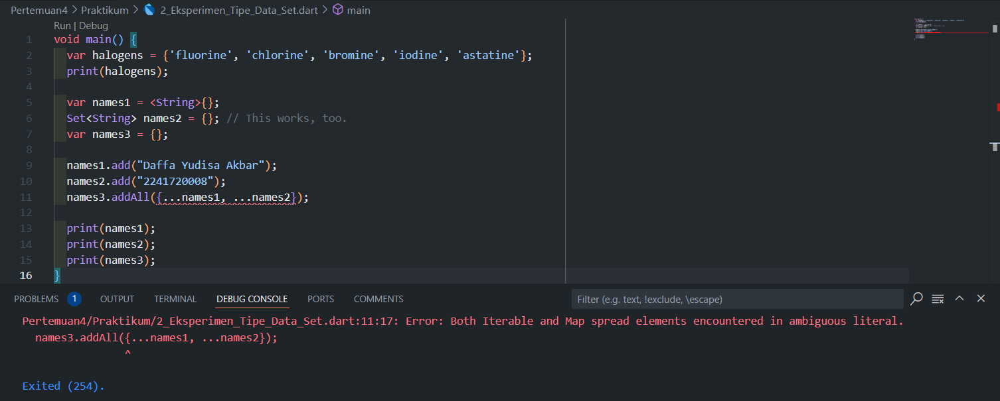

    Error tersebut muncul karena names3 dideklarasikan sebagai sebuah Map (karena menggunakan {} tanpa tipe) dan saya mencoba menggunakan operator spread (...) untuk menggabungkan elemen dari names1 dan names2, yang merupakan Set. Dart tidak dapat menggabungkan elemen dari iterable yang berbeda (set dan map) dalam satu ekspresi spread. Untuk memperbaiki masalah ini, kamu perlu memastikan bahwa names3 adalah Set, bukan Map. 

    Berikut adalah kode program yang benar:

    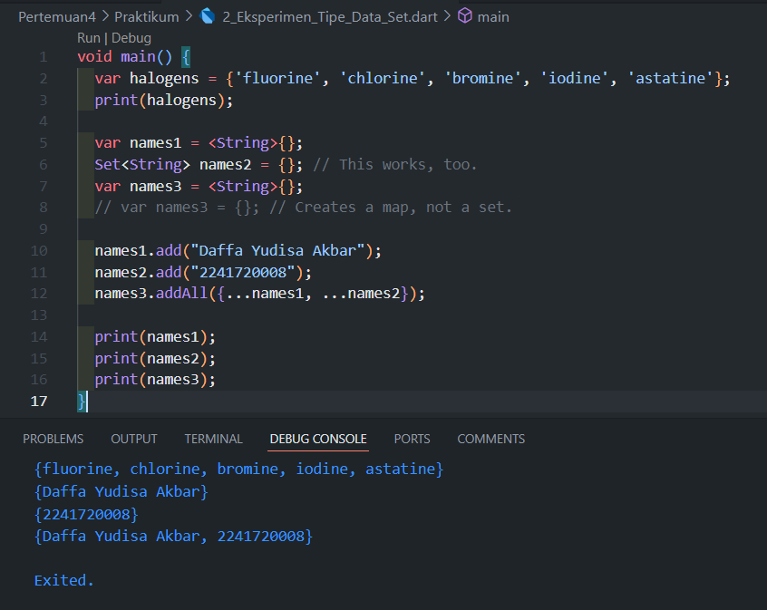


    Karena di soal ada keterangan "Untuk variabel Map dihapus, nanti kita coba di praktikum selanjutnya." Maka variabel names3 bisa dihapus.

    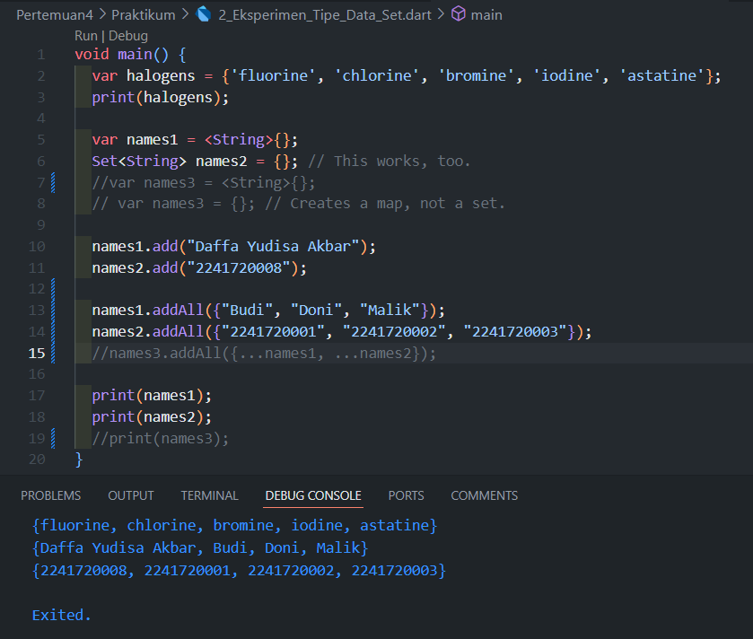

    Fungsi dari add() dan addAll() adalah sebagai berikut:

    add() --> Menambahkan satu elemen ke dalam Set. Jika elemen sudah ada, maka tidak akan ada yang ditambahkan (karena nilai yang sama akan tertimpa). Contoh: names1.add("Daffa Yudisa Akbar");.

    addAll()--> Menambahkan beberapa elemen sekaligus ke dalam Set dari koleksi seperti Set atau List. Jika elemen sudah ada, maka tidak akan ada yang ditambahkan (karena nilai yang sama akan tertimpa). Contoh: names1.addAll({"Budi", "Doni", "Malik"});.

<br></br>

### Praktikum 3
* Langkah 1

    Ketik atau salin kode program berikut ke dalam fungsi main().
    ```dart
    void main() {
    var gifts = {
        // Key:    Value
        'first': 'partridge',
        'second': 'turtledoves',
        'fifth': 1
    };

    var nobleGases = {
        2: 'helium',
        10: 'neon',
        18: 2,
    };

    print(gifts);
    print(nobleGases);
    }
    ```
<br></br>
    
* Langkah 2

    Silakan coba eksekusi (Run) kode pada langkah 1 tersebut. Apa yang terjadi? Jelaskan! Lalu perbaiki jika terjadi error.

    **Jawab**

    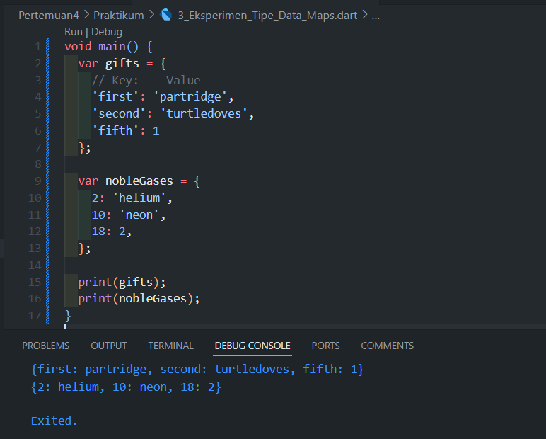

    Program tersebut mendeklarasikan dua variabel berbentuk Map, yaitu gifts dan nobleGases. Variabel gifts menggunakan tipe data string sebagai key dengan value yang  ada terdiri dari string dan integer. Variabel nobleGases menggunakan integer sebagai key, dengan nilai berupa nama unsur gas mulia dalam bentuk string dan angka. Program kemudian mencetak isi dari kedua Map tersebut menggunakan fungsi print(), sehingga isi Map ditampilkan di konsol, seperti gambar di atas.

<br></br>

* Langkah 3

    Tambahkan kode program berikut, lalu coba eksekusi (Run) kode Anda.
    ```dart
    var mhs1 = Map<String, String>();
    gifts['first'] = 'partridge';
    gifts['second'] = 'turtledoves';
    gifts['fifth'] = 'golden rings';

    var mhs2 = Map<int, String>();
    nobleGases[2] = 'helium';
    nobleGases[10] = 'neon';
    nobleGases[18] = 'argon';
    ```

    Apa yang terjadi ? Jika terjadi error, silakan perbaiki.

    Tambahkan elemen nama dan NIM Anda pada tiap variabel di atas (gifts, nobleGases, mhs1, dan mhs2). Dokumentasikan hasilnya dan buat laporannya!

    **Jawab:**

    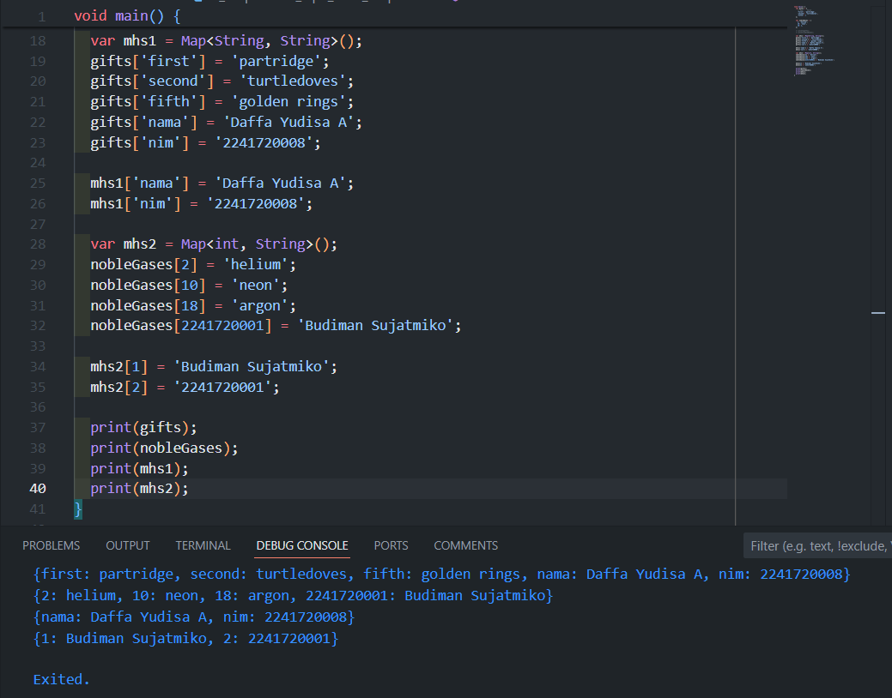

    Tidak terjadi error pada awal ditambahkannya nilai nama dan nim pada variabel gifts, nobleGases, mhs1, dan mhs2. Namun ketika ditambahkan kode program di langkah ke-3 tersebut, variabel mhs1 dan mhs2 tidak dipanggil (untuk ditampilkan). Akhirnya untuk menampilkan nilai dari variabel mhs1 dan mhs2 saya tambahkan perintah print untuk kedua variabel tersebut, sehingga output tambahan yang ditampilkan berupa nama dan nim bisa dilihat pada konsol.

<br></br>

### Praktikum 4
* Langkah 1
    Ketik atau salin kode program berikut ke dalam fungsi main().
    ```dart
    var list = [1, 2, 3];
    var list2 = [0, ...list];
    print(list1);
    print(list2);
    print(list2.length);
    ```

* Langkah 2

    Silakan coba eksekusi (Run) kode pada langkah 1 tersebut. Apa yang terjadi? Jelaskan! Lalu perbaiki jika terjadi error.

    **Jawab:**

    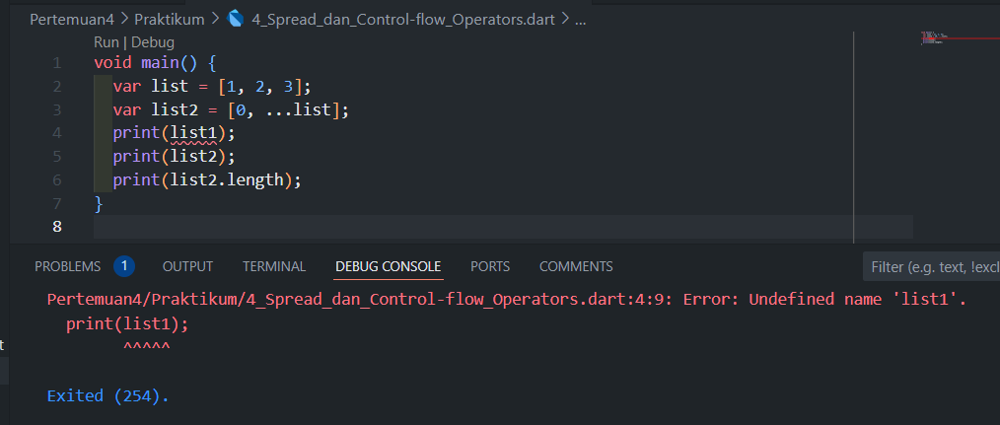

    Setelah dilakukan eksekusi kode program pada langkah ke-1 terjadi error, hal ini karena adanya perintah print untuk menampilkan nilai dari variabel list1 sedangkan variabel tersebut tidak ada. Variabel yang dideklarasikan di langkah ke-1 ada dua yakni list dan list2. Maka agar kode program bisa berjalan sesuai (tidak error)  harus dilakukan perubahan nama variabel list menjadi list1 atau mengubah nama variabel list1 menjadi list pada perintah print dan pada penginisialisasian var list2 . Seperti gambar berikut.

    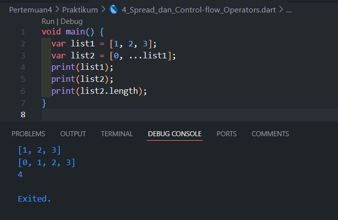
<br></br>

* Langkah 3

    Tambahkan kode program berikut, lalu coba eksekusi (Run) kode Anda.
    ```dart
    list1 = [1, 2, null];
    print(list1);
    var list3 = [0, ...?list1];
    print(list3.length);
    ```

    Apa yang terjadi ? Jika terjadi error, silakan perbaiki.

    Tambahkan variabel list berisi NIM Anda menggunakan Spread Operators. Dokumentasikan hasilnya dan buat laporannya!

    **Jawab:**

    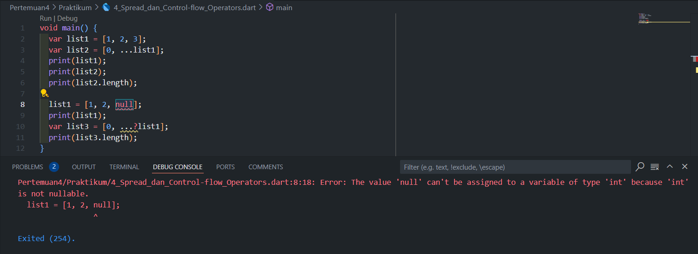

    Terjadi error, hal ini karena adanya nilai null yang ditambahkan pada variabel list1. Kemungkinan besar ini disebabkan oleh pengaturan null safety. Untuk bisa menyimpan nilai null, maka perlu dibuat variabel baru, hal ini karena variabel list1 awal dianggap bertipe data int. Sehingga bisa dilakukan deklarasi variabel baru sehingga nilai null bisa disimpan dalam suatu list atau menambahkan tipe nullable (int?) dalam deklarasi list. Seperti berikut.

    a. Menambahkan tipe nullable (int?) dalam deklarasi list

    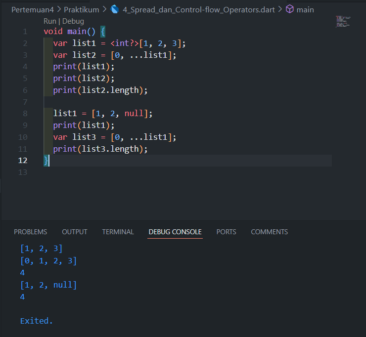

    b. Mendeklarasikan variabel baru

    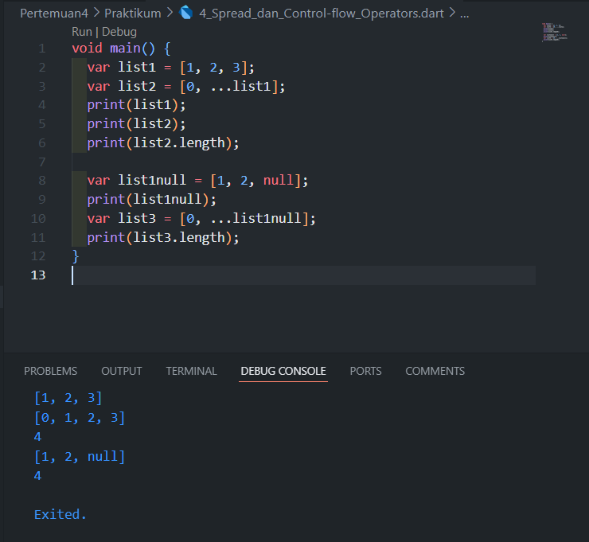

    Menambahkan variabel list berisi NIM Anda menggunakan Spread Operators. 

    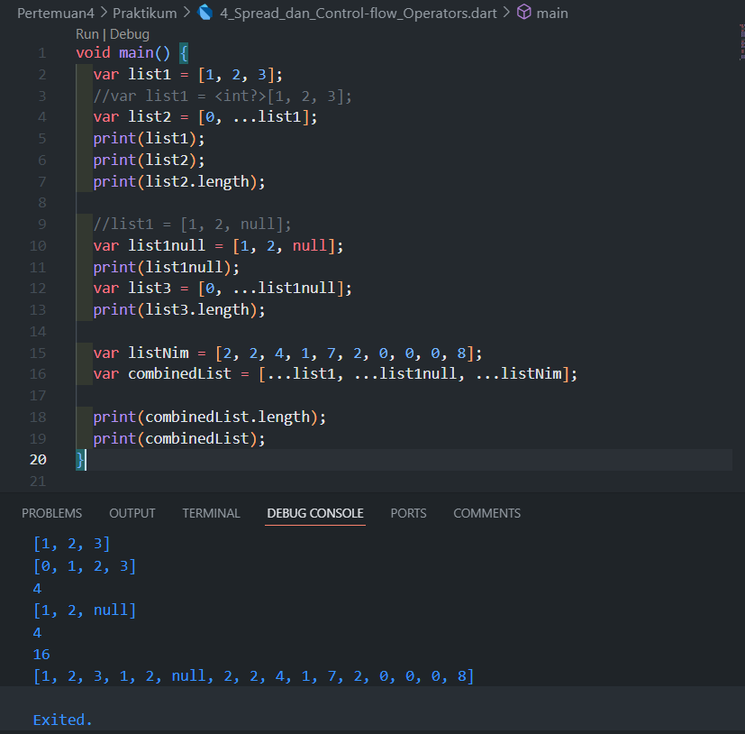

<br></br>

* Langkah 4

    Tambahkan kode program berikut, lalu coba eksekusi (Run) kode Anda.
    ```dart
    var nav = ['Home', 'Furniture', 'Plants', if (promoActive) 'Outlet'];
    print(nav);
    ```

    Apa yang terjadi ? Jika terjadi error, silakan perbaiki. Tunjukkan hasilnya jika variabel promoActive ketika true dan false.

    **Jawab:**

    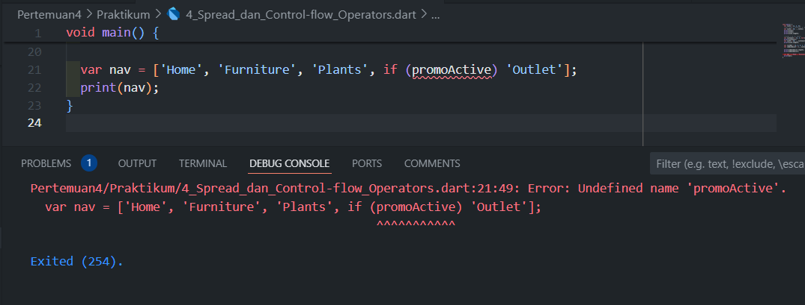

    Error terjadi karena variabel bool promoActive belum diinisialisasikan. Maka untuk menjalankan program tanpa error perlu ditambah variabel promoActive. Seperti gambar dibawah:

    bool promoActive diberi nilai true:

    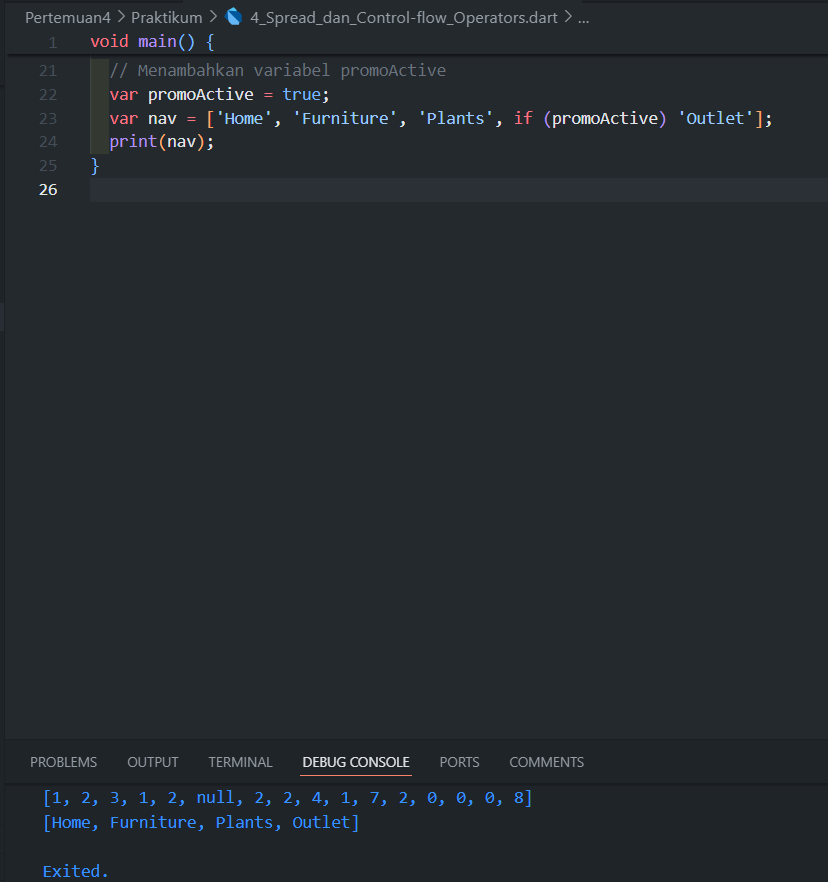

    bool promoActive diberi nilai false:

    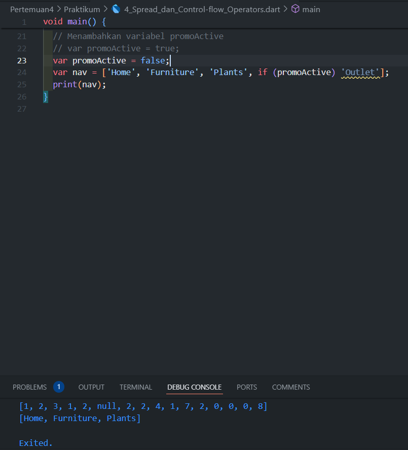

    Jika variabel bool promoActive diberi nilai true, maka akan ditampilkan nilai 'Outlet'. Sedangkan jika bool promoActive diberi nilai false maka nilai 'Outlet' tidak ditampilkan

<br></br>

* Langkah 5

    Tambahkan kode program berikut, lalu coba eksekusi (Run) kode Anda.
    ```dart
    var nav2 = ['Home', 'Furniture', 'Plants', if (login case 'Manager') 'Inventory'];
    print(nav2);
    ```

    Apa yang terjadi ? Jika terjadi error, silakan perbaiki. Tunjukkan hasilnya jika variabel login mempunyai kondisi lain.

    **Jawab:**

    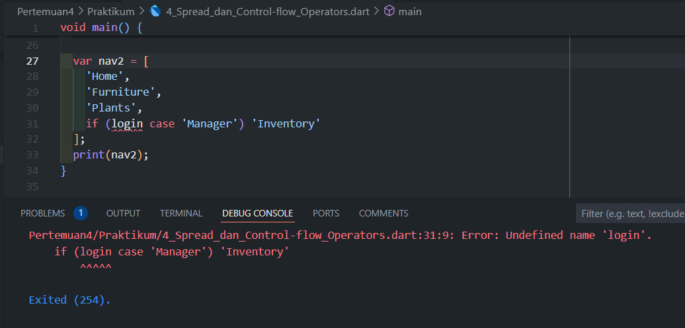

    Error terjadi karena variabel login belum diinisialisasikan. Maka untuk menjalankan program tanpa error perlu ditambah variabel login dengan nilai 'Manager'. Seperti gambar dibawah:

    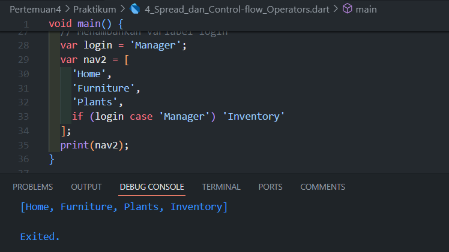

<br></br>

* Langkah 6

    Tambahkan kode program berikut, lalu coba eksekusi (Run) kode Anda.

    ```dart
    var listOfInts = [1, 2, 3];
    var listOfStrings = ['#0', for (var i in listOfInts) '#$i'];
    assert(listOfStrings[1] == '#1');
    print(listOfStrings);
    ```

    Apa yang terjadi ? Jika terjadi error, silakan perbaiki. Jelaskan manfaat Collection For dan dokumentasikan hasilnya.

    **Jawab:**

    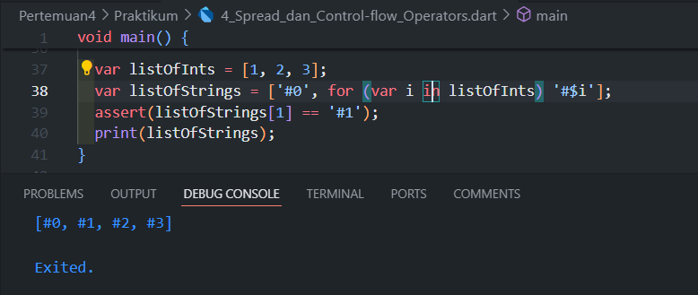

    Kode di atas  mengilustrasikan penggunaan collection for dalam Dart untuk membuat list baru berdasarkan elemen dari list yang sudah ada. Dalam program ini, list listOfInts diinisialisasi dengan tiga angka yakni 1, 2, dan 3. Selanjutnya, list listOfStrings diciptakan dengan elemen pertama adalah string '#0', diikuti oleh elemen yang dihasilkan dari iterasi setiap angka dalam listOfInts. Menggunakan collection for, setiap elemen i ditambahkan ke list dalam format string '#i', sehingga menghasilkan list baru yang berisi ['#0', '#1', '#2', '#3']. Setelah itu akan dicek menggunakan assert, apakah nilai dari indeks ke-1 dari listOfStrings adalah #1, jika benar maka dilanjutkan dengan menampilkan hasil seperti gambar di atas yakni [#0, #1, #2, #3]

    Manfaat dari penggunaan collection for terlihat jelas dari kode program di atas yakni untuk menjadikan kode program lebih ringkas dan mudah dipahami karena elemen baru dapat dibentuk dalam satu ekspresi, tanpa memerlukan loop terpisah.

<br></br>

### Praktikum 5
* Langkah 1
    Ketik atau salin kode program berikut ke dalam fungsi main().
    ```dart
    var record = ('first', a: 2, b: true, 'last');
    print(record)
    ```
    <br></br>

* Langkah 2
    Silakan coba eksekusi (Run) kode pada langkah 1 tersebut. Apa yang terjadi? Jelaskan! Lalu perbaiki jika terjadi error.

    **Jawab:**
    
    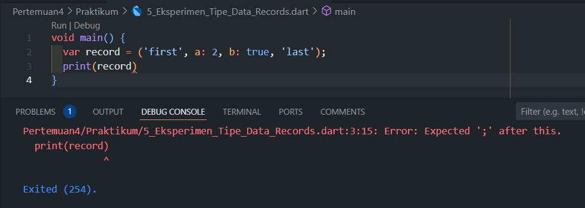

    Terjadi error hal ini karena pada perintah sintaks print pada akhir perintahnya kurang tanda semicolon ";".

    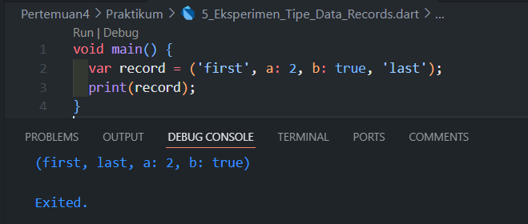

    Pada kode program di atas, tipe data record digunakan untuk menyimpan beberapa nilai yang memiliki tipe data berbeda dalam satu struktur tunggal. Variabel record berisi empat elemen, yaitu dua elemen posisional ('first' dan 'last') dan dua elemen yang diberi nama (a: 2 dan b: true).

    Tipe data record memudahkan pengelompokan beberapa nilai dengan berbagai tipe data seperti string, integer, dan boolean tanpa memerlukan kelas atau struktur data yang lebih kompleks. Ketika print(record) dieksekusi, seluruh isi record akan ditampilkan, yakni ('first', a: 2, b: true, 'last').
    <br></br>

* Langkah 3
    Tambahkan kode program berikut di luar scope void main(), lalu coba eksekusi (Run) kode Anda.
    ```dart
    (int, int) tukar((int, int) record) {
    var (a, b) = record;
    return (b, a);
    }
    ```
    Apa yang terjadi ? Jika terjadi error, silakan perbaiki. Gunakan fungsi tukar() di dalam main() sehingga tampak jelas proses pertukaran value field di dalam Records.

    **Jawab:**

    
    Dalam kode program di atas, setelah memasukkan kode program pada langkah ke-3 tidak akan terjadi error. Namun fungsi tukar juga tidak dipanggil oleh variabel manapun, jadi untuk menunjukkan proses pertukaran value field di dalam records perlu dibuat variabel record2 yang menyimpan nilai int. Kemudian akan dijalankan fungsi tukar terhadap variabel record2 pada variabel hasil, sehingga nilai int pada variabel record2 akan ditukar posisinya menggunakan fungsi tukar dan variabel setelah ditukar tersebut akan disimpan dalam variabel hasil dan ditampilkan keduanya, yakni sebelum diubah posisinya dan setelah diubah seperti gambar di atas.

    Fungsi tukar() didefinisikan untuk menukar dua nilai integer yang terdapat dalam record. Fungsi ini menerima record dengan dua elemen integer, menggunakan teknik destructuring untuk mengakses nilai-nilai tersebut, dan kemudian mengembalikan record baru dengan posisi kedua elemen yang sudah ditukar. 
<br></br>

* Langkah 4
    Tambahkan kode program berikut di dalam scope void main(), lalu coba eksekusi (Run) kode Anda.

    ```dart
    // Record type annotation in a variable declaration:
    (String, int) mahasiswa;
    print(mahasiswa);
    ```
    Apa yang terjadi ? Jika terjadi error, silakan perbaiki. Inisialisasi field nama dan NIM Anda pada variabel record mahasiswa di atas. Dokumentasikan hasilnya dan buat laporannya!

    **Jawab:**

    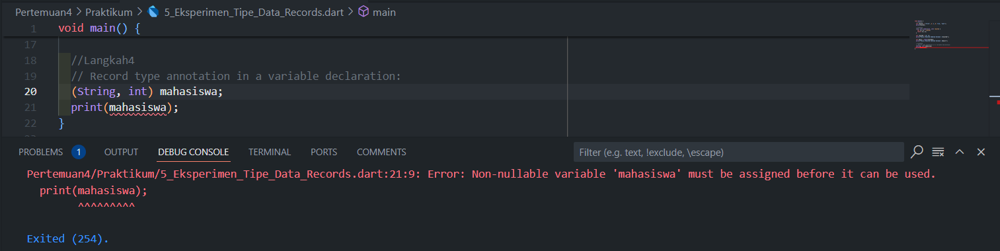

    Dari gambar di atas terjadi error karena saat pemanggilan variabel mahasiswa pada perintah print, variabel mahasiswa masih belum memiliki nilai, sehingga untuk menjalankan kode program di atas perlu dimasukkan nilai dari variabel mahasisawa terlebih dahulu yang sesuai dengan tipe data ditentukan yakni (String, int). Seperti gambar di bawah:

    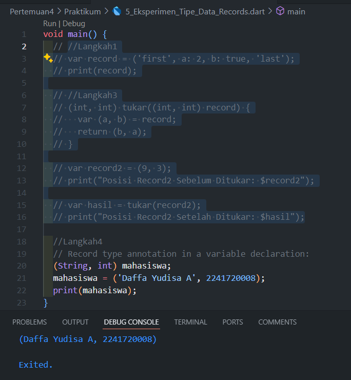

    Setelah diperbaiki dengan inisialisasi nilai 'Daffa Yudisa A' sebagai nama dan 2241720008 sebagai NIM, program dapat dijalankan dengan benar. Hasilnya, record menampilkan (Daffa Yudisa A, 2241720008), yang menunjukkan bahwa Dart mendukung penggunaan record untuk mengelola beberapa tipe data dalam satu struktur sederhana.

<br></br>

* Langkah 5
    Tambahkan kode program berikut di dalam scope void main(), lalu coba eksekusi (Run) kode Anda.

    ```dart
    var mahasiswa2 = ('first', a: 2, b: true, 'last');

    print(mahasiswa2.$1); // Prints 'first'
    print(mahasiswa2.a); // Prints 2
    print(mahasiswa2.b); // Prints true
    print(mahasiswa2.$2); // Prints 'last'
    ```

    Apa yang terjadi ? Jika terjadi error, silakan perbaiki. Gantilah salah satu isi record dengan nama dan NIM Anda, lalu dokumentasikan hasilnya dan buat laporannya!

    **Jawab:**

    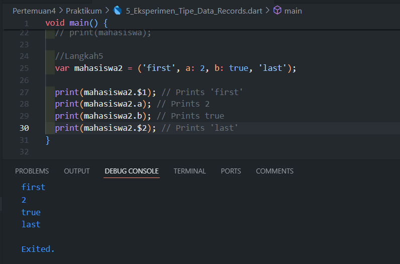

    Pada kode program di atas, sebuah record mahasiswa2 dideklarasikan dengan elemen posisional dan elemen bernama. Elemen posisional ditunjukkan pada elemen 'first' dan 'last', serta elemen bernama yakni a: 2 dan b: true. kode tersebut berhasil dijalankan dan menghasilkan output yang menunjukkan nilai dari elemen dalam record mahasiswa2. Di sini pada perintah print, mahasiswa2.$1 dan mahasiswa2.$2 digunakan untuk mengakses elemen posisional dari variabel mahasiswa2 posisi pertama dan kedua, sedangkan mahasiswa2.a dan mahasiswa2.b mengacu pada elemen dengan nama a dan b yang sudah ada pada variabel mahasiswa2. 

    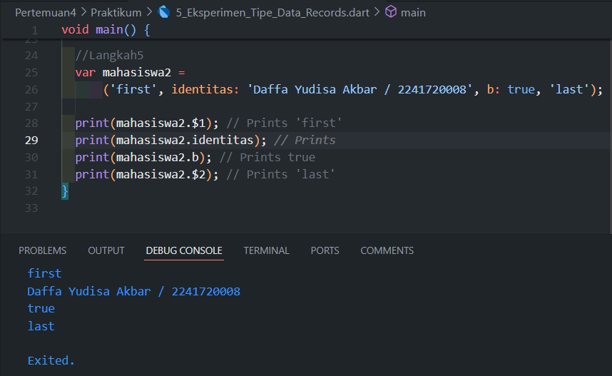

    Gambar di atas menunjukkan salah satu isi record dengan nama dan NIM saya. Saya ubah nama record a menjadi identitas yang berisi nama dan nim. Dan saya tampilkan menggunakan perintah print(mahasiswa2.identitas) yang berarti akan menampilkan nilai dari variabel mahasiswa2 dengan nama record identitas.
<br></br>


