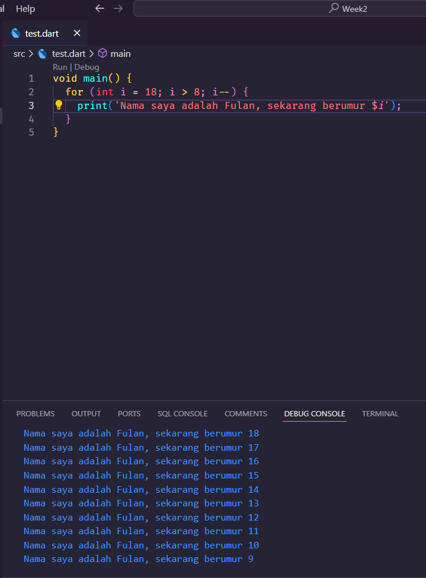

# Laporan Praktikum Dart Week2
**Nama  : Nanda Putra Khamdani** <br>
**Kelas : TI-3H**<br>
**Absen : 18** <br>

1. Modifikasilah kode pada baris 3 di VS Code atau Editor Code favorit Anda berikut ini agar mendapatkan keluar  (output) sesuai yang diminta!  
<br>

<br>
2. Mengapa sangat penting untuk memahami bahasa pemrograman Dart sebelum kita menggunakan framework Flutter ? Jelaskan<br>
``` Karena dart merupakan bahasa dasar dari framework flutter atau flutter dibangun diatas bahasa dart itu sendiri. Semua aplikasi yang dibangun menggunakan flutter ditulis dengan bahasa dart, jadi jika kita tidak memahami bahasa dart maka kita akan kesulitan untuk menggunakan framework flutter``` 
<br>

3. Rangkumlah materi dari codelab ini menjadi poin-poin penting yang dapat Anda gunakan untuk membantu proses pengembangan aplikasi mobile menggunakan framework Flutter. <br>
```
Bahasa dart merupakan bahasa tingkat tinggi yang digunakan oleh flutter, atau dengan kata lain flutter berdiri diatas bahasa dart.

Dart diluncurkan pada tahun 2011 dan terus berkembang hingga saat ini. Dart awalnya dikembangkan untuk pengembangan web sebagai penerus JavaScript, dengan tujuan mengatasi kekurangan JavaScript, seperti ketahanan yang rendah. Kini, Dart lebih fokus pada pengembangan mobile, terutama dengan framework Flutter. Dart menawarkan performa optimal dan alat modern yang stabil untuk proyek berskala besar, didukung oleh plugin IDE yang kuat. Dirancang agar fleksibel dan tangguh, Dart menggabungkan type annotations yang opsional serta fitur OOP, menciptakan keseimbangan antara fleksibilitas dan kekuatan bahasa pemrograman.

kelebihan dan fitur dari pengembangan dart
-Productive tooling: merupakan fitur kakas (tool) untuk menganalisis kode, plugin IDE, dan ekosistem paket yang besar.
-Garbage collection: untuk mengelola atau menangani dealokasi memori (terutama memori yang ditempati oleh objek yang tidak lagi digunakan).
Type annotations (opsional): untuk keamanan dan konsistensi dalam mengontrol semua data dalam aplikasi.
-Statically typed: Meskipun type annotations bersifat opsional, Dart tetap aman karena menggunakan fitur type-safe dan type inference untuk menganalisis types saat runtime. Fitur ini penting untuk menemukan bug selama kompilasi kode.
-Portability: bahasa Dart tidak hanya untuk web (yang dapat diterjemahkan ke JavaScript) tetapi juga dapat dikompilasi secara native ke kode Advanced RISC Machines (ARM) dan x86.

Dart dapat dieksekusi melalui dua cara: Dart Virtual Machines (VMs) dan JavaScript compilation. Eksekusi Dart mendukung runtime systems, core libraries, dan garbage collectors. Dart memiliki dua mode kompilasi: Just-In-Time (JIT), yang mengkompilasi kode saat dibutuhkan dan mendukung debugging serta hot reload, cocok untuk pengembangan; serta Ahead-Of-Time (AOT), yang mengkompilasi sebelumnya untuk performa tinggi namun tanpa fitur debugging atau hot reload.

Dart dirancang untuk oop juga dan seperti bahasa lainnya dart juga memiliki operator dan aritmatika operator, increment decrement dan lainnya. fitur fitur yang dimiliki oleh bahasa modern lain juga dimiliki oleh dart

contoh function pada dart
Function `main` di Dart adalah titik awal eksekusi program, ditandai dengan `void` yang menunjukkan tidak ada data yang dikembalikan. Nama `main` wajib ada agar Dart VM tahu di mana memulai. Tanda kurung `( )` menunjukkan bahwa `main` tidak menerima data, dan kurung kurawal `{ }` digunakan untuk membungkus blok kode function.
```